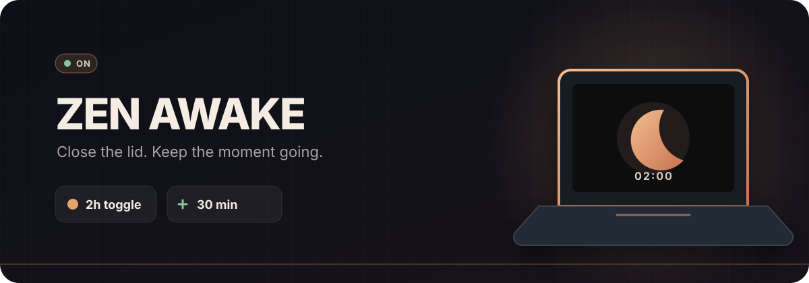

<p align="center">
  
</p>

<p align="center">
  
  
  
</p>

Zen Awake keeps your laptop awake with the lid closed for a limited time. The screen turns
off, audio keeps playing, and normal lid behavior returns when the timer ends.

## Install

```bash
omarchy plugin add https://github.com/zendarc147/omarchy-zen-awake.git --enable --yes
```

## Controls

| | Action |
| --- | --- |
| **Left click** | Toggle 2 hours |
| **Right click** | Add 30 minutes |
| **Middle click** | Turn off |
| **Scroll** | Adjust the timer |

Hover the icon to see the time remaining and lid state. Duration, adjustment
step, countdown display, and suspend-at-end behavior are configurable in
Omarchy.

## Remove

```bash
omarchy plugin remove zen.awake --yes
```

Built for Omarchy Quattro. No external dependencies.

MIT licensed.
